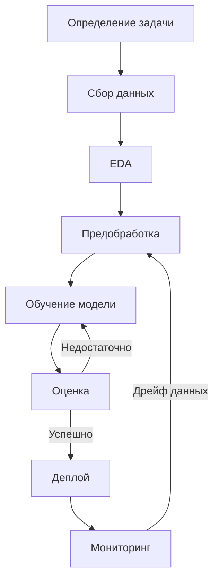

Вот детализированный жизненный цикл ML-проекта с акцентом на практическую реализацию для Python-разработчика:

---

### 1. **Определение проблемы и целей**
**Что делать:**
- Четко сформулируйте задачу (классификация, регрессия, кластеризация)
- Определите метрики успеха ([Accuracy (Точность)](#Accuracy%20(Точность)), [F1-score (Баланс между точностью и полнотой)](#F1-score%20(Баланс%20между%20точностью%20и%20полнотой)), RMSE)
- Оцените бизнес-требования ([Латентность (время предсказания)](#Латентность%20(время%20предсказания)), стоимость ошибки)

**Пример для бота анализа игроков:**
```python
# Цель: предсказать PS игрока (регрессия)
# Метрика: Mean Absolute Error (MAE) < 15
# Ограничение: время предсказания < 100 мс
```

---

### 2. **Сбор и подготовка данных**
**Ключевые действия:**
- Сбор данных из API, БД, CSV/Excel
- Очистка (пропуски, дубликаты, выбросы)
- [Генерация синтетических данных](#Генерация%20синтетических%20данных) при необходимости

**Практический пример:**
```python
import pandas as pd
from utils.ps_parser import get_players_score_from_api

# Загрузка данных
raw_data = await get_players_score_from_api()
df = pd.DataFrame(raw_data).drop_duplicates()

# Обработка пропусков
df['player_ps'].fillna(df['player_ps'].median(), inplace=True)
```

---

### 3. **Разведочный анализ (EDA)**
**Инструменты:**
- Pandas Profiling
- Matplotlib/Seaborn
- Статистические тесты

**Что проверять:**
- Распределения признаков
- Корреляции
- Аномалии

**Пример:**
```python
import seaborn as sns

# Анализ распределения PS
sns.histplot(df['player_ps'], kde=True)
plt.title('Распределение Player Score')
plt.show()
```

---

### 4. **Предобработка данных**
**Типичные операции:**
- Нормализация/стандартизация
- Кодирование категориальных признаков
- Балансировка классов

**Код для предобработки:**
```python
from sklearn.preprocessing import StandardScaler
from sklearn.model_selection import train_test_split

# Разделение данных
X_train, X_test, y_train, y_test = train_test_split(
    df.drop('player_ps', axis=1), 
    df['player_ps'],
    test_size=0.2
)

# Масштабирование
scaler = StandardScaler()
X_train_scaled = scaler.fit_transform(X_train)
X_test_scaled = scaler.transform(X_test)
```

---

### 5. **Выбор и обучение модели**
**Подход:**
- Начните с простых моделей (Linear Regression)
- Постепенно усложняйте (Random Forest, XGBoost)
- Используйте AutoML (PyCaret, AutoGluon) для быстрого тестирования

**Пример:**
```python
from sklearn.ensemble import RandomForestRegressor
from sklearn.metrics import mean_absolute_error

model = RandomForestRegressor(n_estimators=100)
model.fit(X_train_scaled, y_train)

# Оценка
preds = model.predict(X_test_scaled)
print(f"MAE: {mean_absolute_error(y_test, preds):.2f}")
```

---

### 6. **Оптимизация модели**
**Методы:**
- Подбор гиперпараметров (GridSearchCV)
- [5. **Ансамбли моделей**](#5.%20**Ансамбли%20моделей**)
- [6. **Уменьшение размерности**](#6.%20**Уменьшение%20размерности**)

**Пример оптимизации:**
```python
from sklearn.model_selection import GridSearchCV

params = {
    'n_estimators': [50, 100, 200],
    'max_depth': [3, 5, None]
}

grid = GridSearchCV(model, params, cv=5, scoring='neg_mean_absolute_error')
grid.fit(X_train_scaled, y_train)
print(f"Лучшие параметры: {grid.best_params_}")
```

---

### 7. **Развертывание и мониторинг**
**Инструменты:**
- FastAPI/Flask для REST API
- Docker для контейнеризации
- Prometheus/Grafana для мониторинга

**Пример endpoint для бота:**
```python
from fastapi import FastAPI
import joblib

app = FastAPI()
model = joblib.load('model.pkl')

@app.post("/predict")
async def predict(data: dict):
    processed_data = preprocess(data)
    prediction = model.predict([processed_data])
    return {"predicted_ps": prediction[0]}
```

**Мониторинг:**
```python
# Логирование дрейфа данных
from evidently import ColumnDriftMetric
from evidently.report import Report

drift_report = Report(metrics=[ColumnDriftMetric('player_ps')])
drift_report.run(current_data=current, reference_data=historical)
drift_report.save_html('drift.html')
```

---

### 🔄 **Дополнительные этапы для production**
1. **CI/CD пайплайн**: Автоматическое тестирование и деплой
2. **A/B тестирование**: Сравнение новой и старой моделей
3. **Переобучение**: Периодическое обновление модели на новых данных

---

### 📊 **Визуализация жизненного цикла**


Для вашего бота акцент стоит сделать на этапах 2-4 (работа с API Omeda City) и 7 (интеграция с Telegram через aiogram). Оптимизация модели (этап 6) потребуется, если точность предсказаний PS будет недостаточной.


---


> [!QUESTION] Вопрос
> Поясни эти моменты, простыми словами, на понятных примерах:
>- метрики успеха (Accuracy, F1-score, RMSE)
-(латентность предсказаний, стоимость ошибки)
>- Очистка (пропуски, дубликаты, выбросы) - что за выбросы?
>- Генерация синтетических данных при необходимости - что? зачем? пример
-Ансамбли моделей, Уменьшение размерности

### 1. **Метрики успеха** (Как понять, хороша ли модель?)
#### Accuracy (Точность)
**Простыми словами:** Сколько раз модель угадала правильно из всех попыток.  
**Пример:**  
- У вас 100 писем: 90 нормальных, 10 спама.  
- Модель правильно определила 85 нормальных и 5 спам-писем.  
- **Accuracy = (85 + 5) / 100 = 90%**  

**Проблема:** Если спама мало (например, 1%), модель может просто всегда говорить "не спам" и получить Accuracy 99%, но это обманчиво.

#### F1-score (Баланс между точностью и полнотой)
**Простыми словами:** Учитывает и ложные срабатывания, и пропущенные цели.  
**Пример для спам-фильтра:**  
- **Precision (Точность):** Из 20 писем, которые модель назвала спамом, 15 действительно спам → 15/20 = 75%.  
- **Recall (Полнота):** Модель нашла 15 спам-писем из 30 реальных спам-писем → 15/30 = 50%.  
- **F1-score = 2 * (75% * 50%) / (75% + 50%) = 60%** (чем ближе к 100%, тем лучше).

#### RMSE (Root Mean Square Error — ошибка предсказания чисел)
**Простыми словами:** Насколько в среднем модель ошибается в числах.  
**Пример:**  
- Предсказываем цену квартиры (в млн):  
  - Реальная цена: 5, 10, 7  
  - Предсказание: 6, 12, 6  
  - **RMSE = √[((5-6)² + (10-12)² + (7-6)²)/3] ≈ 1.41 млн**  

Чем меньше RMSE, тем точнее модель.

---

### 2. **Латентность и стоимость ошибки**
#### Латентность (время предсказания)
**Пример:**  
- Бот должен отвечать за **менее 0.1 секунды**, иначе пользователь закроет чат.  
- Если модель предсказывает PS игрока за 2 секунды — это неприемлемо.

#### Стоимость ошибки
**Примеры:**  
- **Низкая стоимость:** Бот ошибся в предсказании PS на 5 пунктов — ничего страшного.  
- **Высокая стоимость:** Модель в кредитном скоринге ошиблась и одобрила невозвратный кредит — банк теряет деньги.

---

### 3. **Очистка данных**
#### Пропуски
**Пример:** В таблице игроков нет PS у некоторых:  
- **Решение:** Заменить средним значением или удалить строку.

#### Дубликаты
**Пример:** Один и тот же игрок записан дважды:  
- **Решение:** Оставить только уникальные записи.

#### Выбросы (аномалии)
**Пример:**  
- У 99% игроков PS от 50 до 150, но у одного записан PS 999 (очевидно, ошибка).  
- **Решение:** Удалить или заменить на разумное значение (например, 150).

---

### 4. **Генерация синтетических данных**
**Зачем?** Если данных мало (например, всего 50 игроков), модель не научится.  
**Пример:**  
- Есть 10 записей о матчах.  
- **Генерируем** ещё 90 искусственных записей, сохраняя статистику  
**Важно:** Синтетические данные должны быть похожи на реальные!

---
#### Код:
```python
from sklearn.datasets import make_regression
X_synthetic, y_synthetic = make_regression(
    n_samples=90,      # Создать 90 примеров
    n_features=5,      # Каждый пример имеет 5 характеристик
    noise=10           # "Разброс" в данных для реалистичности
)
```

#### Аргументы:
1. **n_samples=90**: Нужно, если реальных данных мало (например, всего 10 записей).  
   → Модель не обучается на малых данных → создаём искусственные примеры.

2. **n_features=5**:  
   - Например, для игрока: часы в игре, уровень, победы, поражения, точность ударов.  
   - Библиотека сама генерирует осмысленные связи между этими признаками и целевой переменной (y_synthetic).

3. **noise=10**:  
   - Добавляет "шум" (случайные отклонения), чтобы данные не были идеальными.  
   - Без шума модель переобучится (как если бы училась на учебнике без исключений).

#### Зачем это нужно?
- **Проблема**: Реальных данных о PS игроков мало (например, только топ-10 игроков). 
- **Решение**: Дополняем их 90 синтетическими игроками со схожими паттернами.  
- **Аналог**: Учим ребёнка рисовать кошек, дорисовывая недостающие примеры в альбоме.

#### Ограничения:
— Синтетические данные должны **имитировать реальные закономерности**.  
— Проверяйте, что модель, обученная на них, работает и на реальных данных.  

Пример визуализации сгенерированных данных:
```python
import matplotlib.pyplot as plt
plt.scatter(X_synthetic[:, 0], y_synthetic, alpha=0.5)
plt.xlabel('Feature 1 (e.g., игровые часы)')
plt.ylabel('Target (e.g., PS)')
plt.title('Синтетические данные игроков')
plt.show()
``` 

Вы увидите облако точек с трендом (например, чем больше Feature 1, тем выше PS), но с случайными отклонениями (noise=10).

---

### 5. **Ансамбли моделей**
**Простыми словами:** Объединение нескольких моделей для лучшего результата.  
**Пример:**  
- **Как жюри на конкурсе:**  
  - 3 эксперта (модели) оценивают PS игрока.  
  - **Random Forest** берёт среднее от их оценок.  
  - **XGBoost** даёт больше веса более точным экспертам.  

**Код:**  
```python
from sklearn.ensemble import VotingRegressor
from sklearn.linear_model import LinearRegression
from sklearn.tree import DecisionTreeRegressor

model1 = LinearRegression()
model2 = DecisionTreeRegressor()
ensemble = VotingRegressor([('lr', model1), ('dt', model2)])
ensemble.fit(X_train, y_train)
```

---

### 6. **Уменьшение размерности**
**Простыми словами:** Упрощение данных без потери смысла.  
**Пример:**  
- У игрока 100 характеристик (возраст, ранг, время в игре, и т.д.).  
- **PCA** находит 5 главных "компонент" (например, "опытность", "активность"), которые объясняют 95% данных.  

**Код:**  
```python
from sklearn.decomposition import PCA
pca = PCA(n_components=5)
X_reduced = pca.fit_transform(X)
```

**Эффект:** Модель обучается быстрее, а точность может даже вырасти!

---

### Итоговая аналогия:
Представьте, что вы учите ребёнка отличать фрукты:
- **Accuracy** — сколько раз он угадал верно.  
- **F1-score** — учитывает, что путать банан с огурцом хуже, чем с апельсином.  
- **Очистка данных** — убрать гнилые фрукты из учебной корзины.  
- **Синтетические данные** — нарисовать фрукты, которых не хватает.  
- **Ансамбли** — спросить мнение папы и мамы перед ответом.  
- **Уменьшение размерности** — учить не по 100 признакам (цвет, вес, запах...), а по 3 главным.


---
> [!QUESTION] Вопрос
Поясни эти моменты, простыми словами, на понятных примерах:
>- метрики успеха (Accuracy, F1-score, RMSE)
-(латентность предсказаний, стоимость ошибки)
>- Очистка (пропуски, дубликаты, выбросы) - что за выбросы?
>- Генерация синтетических данных при необходимости - что? зачем? пример
>-Ансамбли моделей, Уменьшение размерности


### Суть формулы F1-score

**F1-score** — это "среднее гармоническое" точности (Precision) и полноты (Recall), которое **наказывает за дисбаланс** между этими метриками. 

#### Формула:
```
F1 = 2 * (Precision * Recall) / (Precision + Recall)
```

#### Почему именно так?
1. **Обычное среднее (арифметическое)** даст 62.5% для (75% + 50%)/2, но это скроет проблему низкого Recall.
2. **Гармоническое среднее** строго наказывает за разброс значений:
   - Если Precision = 100%, а Recall = 50% → F1 ≈ 67% (дальше от 100%).
   - Если Precision = 75%, Recall = 75% → F1 = 75% (баланс).

#### Пример с детектором спама:
- **Precision = 75%**: Из всех помеченных как спам, 75% действительно спам.
- **Recall = 50%**: Нашли только половину реального спама.
- **F1 = 60%**: Показывает, что модель не идеальна, особенно в Recall.

---